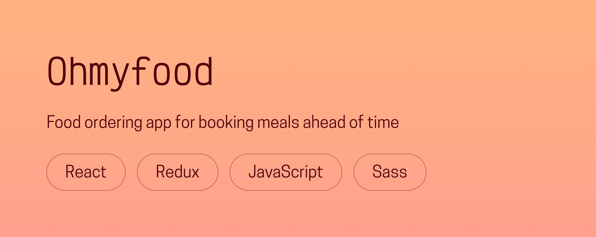

# 🍽️ Ohmyfood

**A modern redesign of a fictional restaurant pre-ordering platform, rebuilt with React, Redux, and Sass.**  
Created in 2023 as part of my front-end development studies.

---

## 🌟 Overview
Ohmyfood is a platform that allows users to browse restaurants, explore their menus, and pre-order dishes before visiting.  

Each restaurant has a dedicated menu page, with dishes sorted by category, interactive like buttons, and a responsive order summary system.

Originally built in **HTML and Sass**, this project was **fully remade with React, Redux, and Sass** to reflect my progress as a developer, with a focus on accessibility, modular architecture, and seamless UI interactions.

---

## 🖥️ Live demo
👉 [**Visit Ohmyfood**](https://ohmyfood.chloeadrian.dev/)  

You can also see its dedicated project page on my [**portfolio**](https://chloeadrian.dev/en/project/ohmyfood).

---

## ⚙️ Tech stack
- **React** for component-based UI  
- **Redux** for global state management  
- **Sass** for modular and maintainable styles  
- **HTML5 & modern CSS** principles for accessibility and responsiveness  

---

## 🧠 Key features
- Browse restaurants and explore full menus  
- Like your favorite restaurants  
- Add and remove dishes from your order  
- Automatically calculates totals by restaurant  
- Fully responsive layout with animated transitions  

---

## 🕊️ Reflection
This project represents a milestone in my learning: transitioning from static web design to dynamic, state-managed front-end development. It was also a valuable exercise in accessibility and visual polish, blending design and code in a cohesive user experience.

---

Thanks for reading, and bon appétit!   
Chloé Adrian ✨